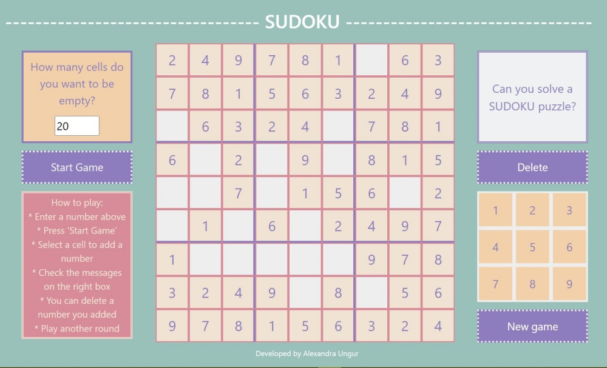

# Sudoku

The classic game of sudoku

## Gameplay :information_source:

The objective is to fill a 9 × 9 grid with digits so that each column, each row, and each of the nine 3 × 3 subgrids that compose the grid (also called "boxes", "blocks", or "regions") contain all of the digits from 1 to 9. The puzzle setter provides a partially completed grid, which for a well-posed puzzle has a single solution.

## Technologies:pencil:

HTML CSS JavaScript
